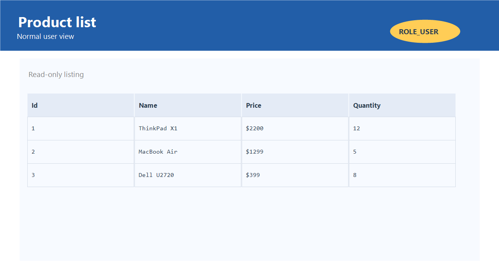
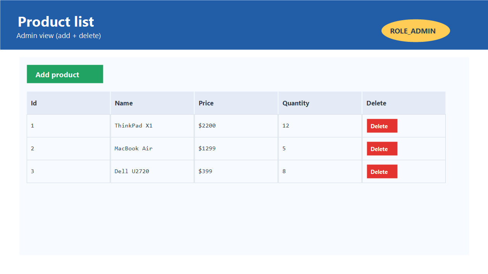

# Product Manager - Spring Boot MVC

Spring Boot 3 MVC app with Thymeleaf pages, JSON endpoints, and Spring Security roles to manage products.

## Overview
- View all products in a table.
- Admins can add and delete products; normal users are read-only.
- Built for demos and coursework; H2 in-memory database by default.

## Accounts (default logins)
- `user1` / `1234` (ROLE_USER)
- `user2` / `1234` (ROLE_USER)
- `admin` / `1234` (ROLE_ADMIN, ROLE_USER)

## Role-based behavior
- `GET /user/` -> list page (visible to USER and ADMIN)
- `GET /admin/add` -> product form (ADMIN only)
- `POST /admin/save` -> persist a product (ADMIN only)
- `GET /admin/delete?id={id}` -> delete a product (ADMIN only)
- `GET /json` -> JSON list of products (USER or ADMIN)

## Screenshots
### User view (read-only list)


### Admin view (add + delete)


## Data model and validation
- `id`: `Long`, generated with `IDENTITY`
- `name`: required, length 4-50
- `price`: minimum 0
- `quantity`: minimum 1

## Stack
- Java 21, Spring Boot 3.5.11
- Spring MVC + Thymeleaf, Spring Data JPA
- Spring Security (form login)
- H2 in-memory DB
- Bootstrap 5.3.8 via WebJars
- OpenAPI UI: `http://localhost:8080/swagger-ui/index.html`

## Run locally
Prereq: JDK 21.

```bash
# Windows
mvnw.cmd spring-boot:run

# Linux / macOS
./mvnw spring-boot:run
```

Application URL: `http://localhost:8080`
H2 console: `http://localhost:8080/h2-console` (JDBC url `jdbc:h2:mem:products-db`)

## Project layout
```text
src/main/java/org/example/web_mvc_products/
  WebMvcProductsApplication.java
  entity/Product.java
  dao/ProductRepo.java
  ws/ProductController.java
  ws/ProductRestApi.java
  security/SecurityConfig.java

src/main/resources/
  application.properties
  templates/products.html
  templates/form.html
```

## Notes
- The in-memory H2 database resets on each restart.
- MySQL driver is on the classpath but not configured; set `application.properties` if you want to use it.
